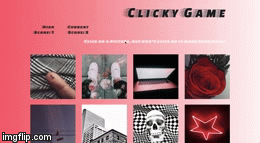

# &#35;Clicky Game&nbsp;&nbsp;
<img 

## What is This?
this is a memorization click game. The object of the game is to click out of the 12 pictures only once. If you repeat, you lose and the score is reset.

## Technologies Utilized
* [React](https://reactjs.org/)
* [JavaScript/ES6](http://es6-features.org/#Constants)
* [JSX](https://reactjs.org/docs/introducing-jsx.html)
* [Yarn dependencies mgmt](https://yarnpkg.com/en/)
* [Node dependencies](https://nodejs.org/en/)
* [Bootstrap 4](https://getbootstrap.com/)
* [Google Fonts](https://fonts.google.com/)
* [heroku](https://www.heroku.com)
* [macOSMojave 10.14.2](https://support.apple.com/kb/DL1986?locale=en_US)
* [VSCode](https://code.visualstudio.com/)

## How to Install and Run
01. git clone https://github.com/ReturnofVenus/clicky-game.git
